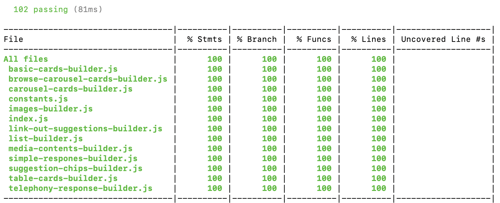

# Dialogflow Fulfillment Response Builder

The Dialogflow Fulfillment Response Builder is a library that helps you to build the responses with ease in order to connect your Dialogflow agent with different platforms. It supports fulfillment responses for multiple platforms like Text, Google Assistant, Telephony and Facebook Messenger.
This NodeJS library accelerates the development and works like a response builder for Dialogflow V2 agents.

* Industry: This is applicable across Industries.

## Problem Statement

To have a single library that builds fulfillment responses specific to Dialogflow agents in coordination with multiple platforms supported by Dialogflow like Text, Google Assistant, Telephony, Facebook Messenger, etc.

## Solution

This Response Builder exposes certain methods that provides the developers a user friendly interface for building dialogflow fulfillment response. The methods collate all the necessary parameters required for each platform and generates a final response that can be used across platforms.

## Usage Instructions

```javascript
const dialogflowFullfillment = require("dialogflow-fullfilment-builder");

const config = {
    "platformsEnabled": [ "ACTIONS_ON_GOOGLE", "TELEPHONY" ] // define the platforms to be supported as per requirement
};

let request = {}; // dialogflow fulfillment request body

let fulfillment = new dialogflowFullfillment(config, request);

fulfillment.setResponseText("Hello");
```


## Testing
Detailed guide on how to run unit test cases 

```bash
npm test
```

## Test Results


## Issues & References
* For bugs, please add an issue on [Github](https://github.com/Quantiphi/dialogflow-fulfillment-builder/issues)
* For Documentation [See documentation.md](documentation.md)

## License
[See LICENSE](LICENSE)
